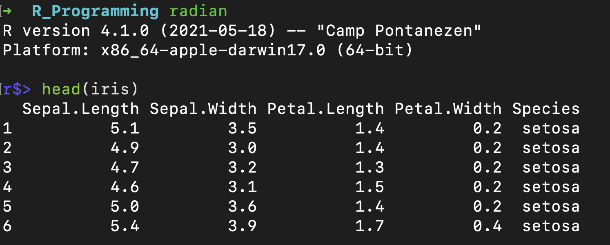
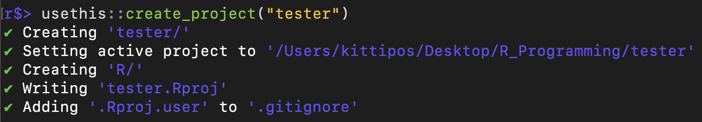
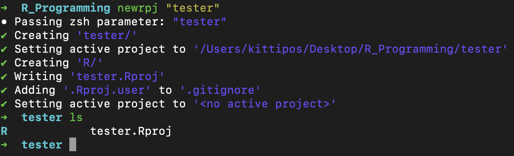
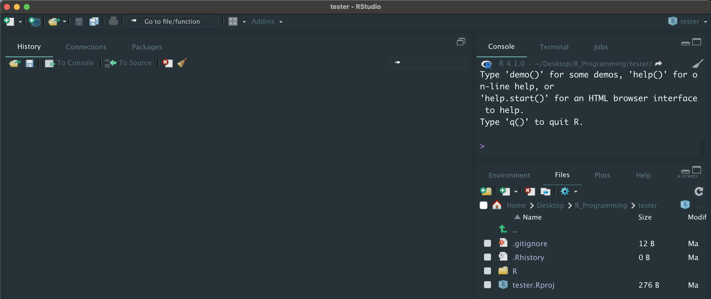

I am an **R** user who know a little bit of **linux shell**, one day I wonder...

-   How do I **navigate and open R project** from the shell, and

-   How do I **create R project** from the shell

This blog post will show you how to do that and hopefully you'll learn something new and enjoy using it!

**What you'll need**

-   A basic knowledge of **linux shell** and **shell scripting**
-   Most of your R project should be in one place

In the next demonstraction, I'll walk you through by creating a **shell function** which you have to store it in `~/.bashrc` or `~/.zshrc` (or other locations that can be sourced) by yourself.

Before I started, I using macOs, and my shell is **zsh** running in a Terminal app. If you are using different shell, modify the code correspondingly.


```zsh
$SHELL --version
```

```
## zsh 5.8 (x86_64-apple-darwin21.0)
```

# Navigate & Open R project

## Quick Navigation

How to navigate to an R project quickly ? Lots of options can do it without using a mouse, e.g. using Spotlight Search in mac, but to day I'll use **command line**.

I like to group *most* of my R projects in a single directory (i.e. `R_programming`) so that I can navigate easily even with GUI. That will helpful when using CLI too.

You might already know `cd` command which change directory of a terminal, but typing `cd` multiple times can be time consuming.

> A simple solution is to creating a **shell function** to change directory to a parent folder which contains R projects.


```zsh
# Define a function to change directory
cdrpg(){
    cd "/Users/kittipos/Desktop/R_Programming"
}

# Call function to change directory to `R_Programming/`
cdrpg

# Print working directory
pwd
```

```
## /Users/kittipos/Desktop/R_Programming
```

In the code above.[^1]

[^1]: You can also define an `alias` instead of function, but I like to use function because It can handle larger code better. Also, another way is to assign path to a `$VARIABLE` and `cd $VARIABLE`, but you might have to type more characters.

1.  I define a shell function `cdrpg()` that change directory to my `R_programming` folder

2.  I execute `cdrpg`, and the directory is then changed (to call function in shell, you don't use parenthesis).

3.  Call `pwd` to confirm the location at `R_Programming` directory

For me, I store this function in a `.zsh` file that can be sourced by `~/.zshrc`

**`cd-to.zsh`**

``` zsh
#!/bin/zsh

# CD to R_Programming Folder
cdrpg(){
    cd "/Users/kittipos/Desktop/R_Programming"
}
```

And, make it executable by:

``` zsh
chmod +x "cd-to.zsh"
```

So that every time I open shell, I could call `cdrpg`, and I would arriving at `R_Programming` directory.

And I also define similar functions to `cd` to other frequently-visited locations in this `cd-to.zsh` script as well.

## Open R project

After I've arrived at `R_Programming/` and `cd` to the sub-directory I wanted, I can open R project from shell with the following command

``` zsh
open *.Rproj
```

The result is similar to clicking `.Rproj` icon to open an RStudio project.

To save typing, I wrap this into `openrpg()` function and store it in a shell script which can be sourced by `~/.zshrc`

**`r-proj.zsh`**

``` zsh
#!/bin/zsh
# A function to open R project in current directory
openrpg(){
    open *.Rproj
}
```

And, make it executable by:

``` zsh
chmod +x "r-proj.zsh"
```

# Create R Project

Now, the last part is a little bit tricky!

First, let's me show the easy way to do in shell by executing R code directly.

## Using Radian Console

The [radian](https://github.com/randy3k/radian) is a modern R console in the shell. First, enter R by running `radian`, then type any R code. The result looks pretty.



To create a new project, you can use [`usethis::create_project("path-to-project")`](https://usethis.r-lib.org/reference/create_package.html)



It's done!, however, there is quite a bit of typing.

Next, I'll show you to all of this *plus* open an R project being created all in one line of code with fewer characters.

## Create R Project directly from Shell

### The Goal

**What I want to achieve is this...**

If I run this command in shell,

``` zsh
newrpj "foo"
```

the R project "foo" should be created, then in my terminal it should `cd` to `foo/` directory, and open `foo.Rproj` file in RStudio.

We'll need to do a couple of things:

1.  Execute that R script from Shell, and also passing R project name as shell argument.
2.  Put all necessary R functions in an R script. I'll call it `new-rpj.R`
3.  Wrap all shell commands into one shell function

### Execute R Script from Shell

[Command Line Basics for R Users](https://bash-intro.rsquaredacademy.com/r-command-line.html) show that `Rscript` command is the way to execute R script from shell.

The basic usage is quite simple.

``` zsh
Rscript "/Users/kittipos/bin-ks/helper/R/new-rpg.R" "foo"
```

This will execute `new-rpj.R`, and "foo" is a shell argument to be passed to the script.

### Write R Script

Now, let's edit `new-rpj.R`

**new-rpj.R**

``` r
# Retrieve Shell arguments
arg <- commandArgs(trailingOnly = TRUE)[1]

# Show what parameter is being recieved
cat("- Passing zsh parameter:", arg)

# Create R Project using name we've supply
usethis::create_project(arg, rstudio = TRUE)
```

1.  `commandArgs()` is a function to retrieve shell arguments, `trailingOnly = TRUE` will only get the one that we've supply, for more example [see r-bloggers post](https://www.r-bloggers.com/2015/02/bashr-howto-pass-parameters-from-bash-script-to-r/).

2.  Assign the first shell argument to `arg`

3.  `cat()` to confirm the passing parameter.

4.  Lastly, `usethis::create_project()` to create an R project with name from `arg`. Use `rstudio = TRUE` to also create `.Rproj` file.

After saving this script `new-rpg.R`, try running this in the shell:

``` zsh
Rscript "/Users/kittipos/bin-ks/helper/R/new-rpg.R" "foo"
```

It should create R project "foo" as a sub-directory of your current working directory.

### Wrap up everything

Finally, let's wrap-up everything by building `newrpj` function to create R project, change directory to the project folder, and open the project in RStudio.

I store this function in `r-proj.zsh` which can be sourced by `~/.zshrc`.

**`r-proj.zsh`**

``` zsh
#!/bin/zsh
## Function to create new R Project, `cd` to the project, and open in RStudio
newrpj(){
    # Create R project in a sub-directory with names from shell 1st argument
    Rscript "/Users/kittipos/bin-ks/helper/R/new-rpj.R" "$1"
    # Go into that sub-directory & Open R project in RStudio
    cd "$1"
    open *.Rproj
}
```

-   Notice `$1` which is a [shell variable](https://www.shellscript.sh/variables2.html) that represents the first argument supplies to the `newrpj()` function, which, in this case, is an R project name.

Here is the result of calling `newrpj` with argument "tester"

1.  Created RStudio project named **"tester"**

2.  Change working directory to **tester**, and

3.  Open RStudio




