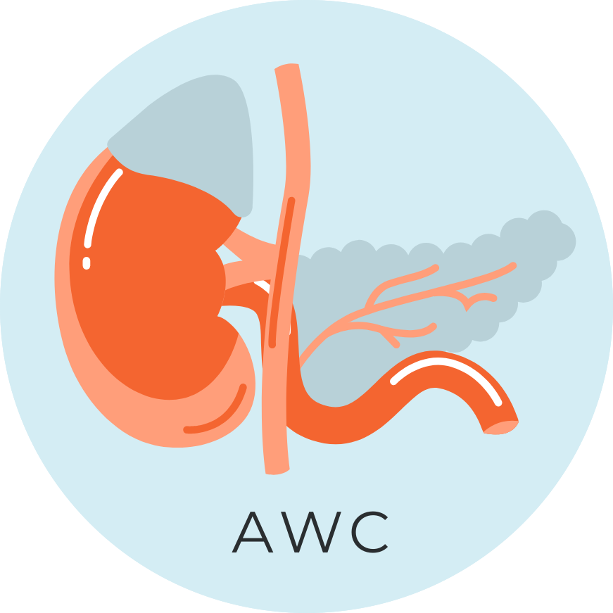
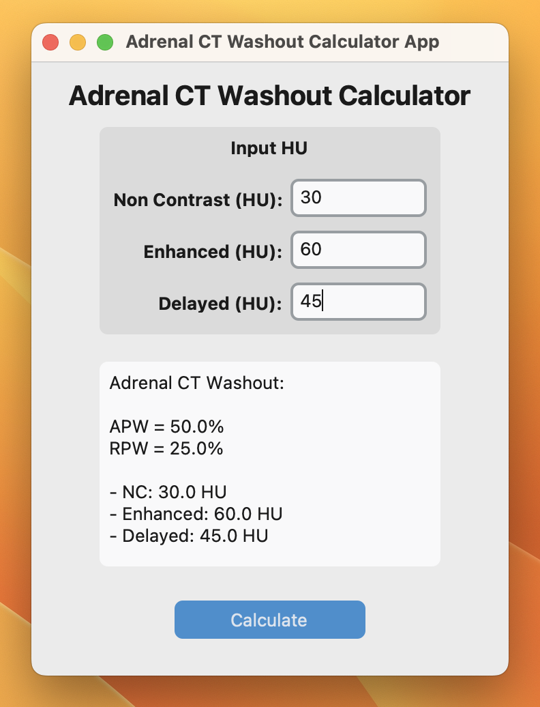
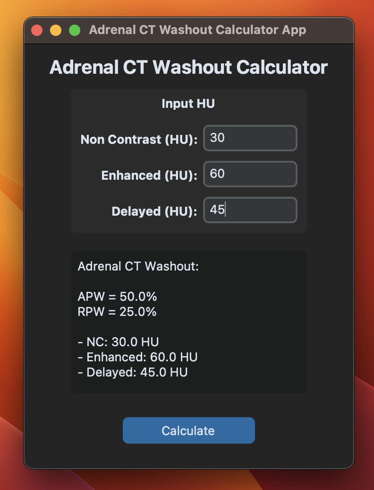

## Goal

Adrenal CT Washout Calculator (AWC) application calculate percentage adrenal washout (APC, RPC) from input HU in CT non-contrast, enhanced, and delayed phase for characterizing benign vs malignant nature of incidental adenoma. 

Light             |  Dark
:-------------------------:|:-------------------------:
  |  

## Ingredient

This is a Python GUI application build with [CustomTkinter](https://github.com/TomSchimansky/CustomTkinter) package.

- Source Code: [GitHub](https://github.com/Lightbridge-KS/adrenal_washout_app)
- Download App: [Release](https://github.com/Lightbridge-KS/adrenal_washout_app/releases) 

### Reference

- Boland, G. W. L. (2011). Adrenal imaging: Why, when, what, and how? Part 2. What technique? American Journal of Roentgenology, 196(1), W1–W5. https://doi.org/10.2214/AJR.10.4205

