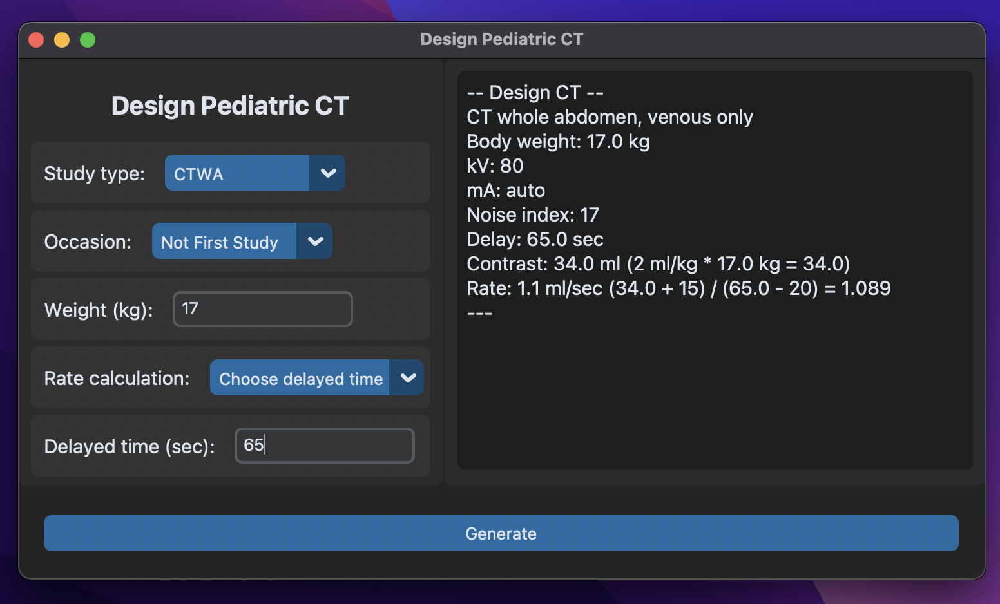

## Goal

The goal of this *prototype* application is to generate a template for designing a pediatric CT protocol in my institution.

## App Design

**Input:**

- **Study Type:** Specify the type of CT scan (e.g., Chest CT).
- **Body Weight:** Enter the patient's weight in kilograms (kg).
- **CT Occasion:** Indicate whether the patient has previously undergone a CT scan.
- **Abdominal CT Specifics:** For whole abdomen CT scans (with or without chest inclusion), provide an option to set a delay time in seconds (sec).

**Output:**

- Template for specified CT protocol in plain text.

## Ingredient

This is a Python GUI application build with [CustomTkinter](https://github.com/TomSchimansky/CustomTkinter) package.

- Source Code: [GitHub](https://github.com/Lightbridge-KS/PedDesign-Desktop)
- Download App: [Release](https://github.com/Lightbridge-KS/PedDesign-Desktop/releases)

> **Important remark:** Please be aware that the actual design of a pediatric CT protocol for clinical use demands *oversight* by a qualified pediatric radiologist. The "PedDesignCT" application is currently in a prototype stage and should primarily be viewed as a conceptual tool. Its purpose is to inspire and aid in the development of customized applications that could be beneficial in specific medical settings. It is not intended for direct clinical application without thorough expert review and adaptation to the unique needs of each patient.