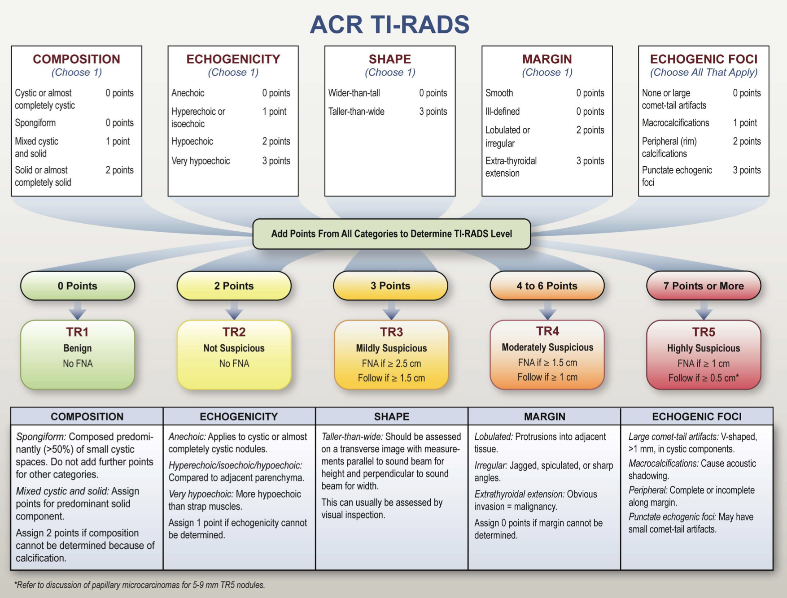

## What

> [TI-RADS Calculator App](https://kittipos.shinyapps.io/tirads-calc/) is a web application that facilitate categorization of Thyroid nodule by ultrasound using [TI-RADS™](https://www.acr.org/Clinical-Resources/Reporting-and-Data-Systems/TI-RADS) system, and also provides some management suggestions.

## Why

Just pure curiosity and passion for building web application that relevant in my field. Using Quarto & Shiny combination (described next) is also very fun !

## Design

This app directly implement logic from the following diagram. It is programmatically *hard-coded*, since the goal here is not to predict result from some kind of model, but to give an interactive experience as you selecting choices from each categories (with examples of ultrasound images included) and the final results are displayed at the bottom of the app.

## Ingredients

> Please feel free to browse source code in [GitHub](https://github.com/Lightbridge-KS/tirads-calc).

This app is written in **`R`** programming language with **Quarto** & **Shiny** framework as described [here](https://quarto.org/docs/interactive/shiny/index.html).

-   [**Quarto**](https://quarto.org) is an open-source scientific and technical publishing system, a next-generation [R Markdown](https://rmarkdown.rstudio.com) that language and engine agnostic. The source code of this app was written in quarto's markdown and rendered to HTML combined with server-side processing by Shiny.

-   [**Shiny**](https://shiny.rstudio.com) is an R package for web application framework. It was primary use for delivers products of R code to the user ([Shiny for Python](https://shiny.rstudio.com/py/) are in development). 

The great thing about using Shiny in Quarto document is that it leverage *beautiful* Quarto's UI "out of the box". Also, Quarto's features such as table of contents, tabset panels, and cross-referencing are available, as I've implemented them in this app.

Note that the server logic comes from another experimental R package: [`{radcalc}`](https://github.com/Lightbridge-KS/radcalc).

## Summary

This is the things that could be improve:

- **Client-side processing:** [Observable.js](https://quarto.org/docs/interactive/ojs/) looks very interesting for faster interactivity in the web browser. (One of my to-learn list !)

I've not build web app for a while, writing this app has **so much fun !** 🥳.

