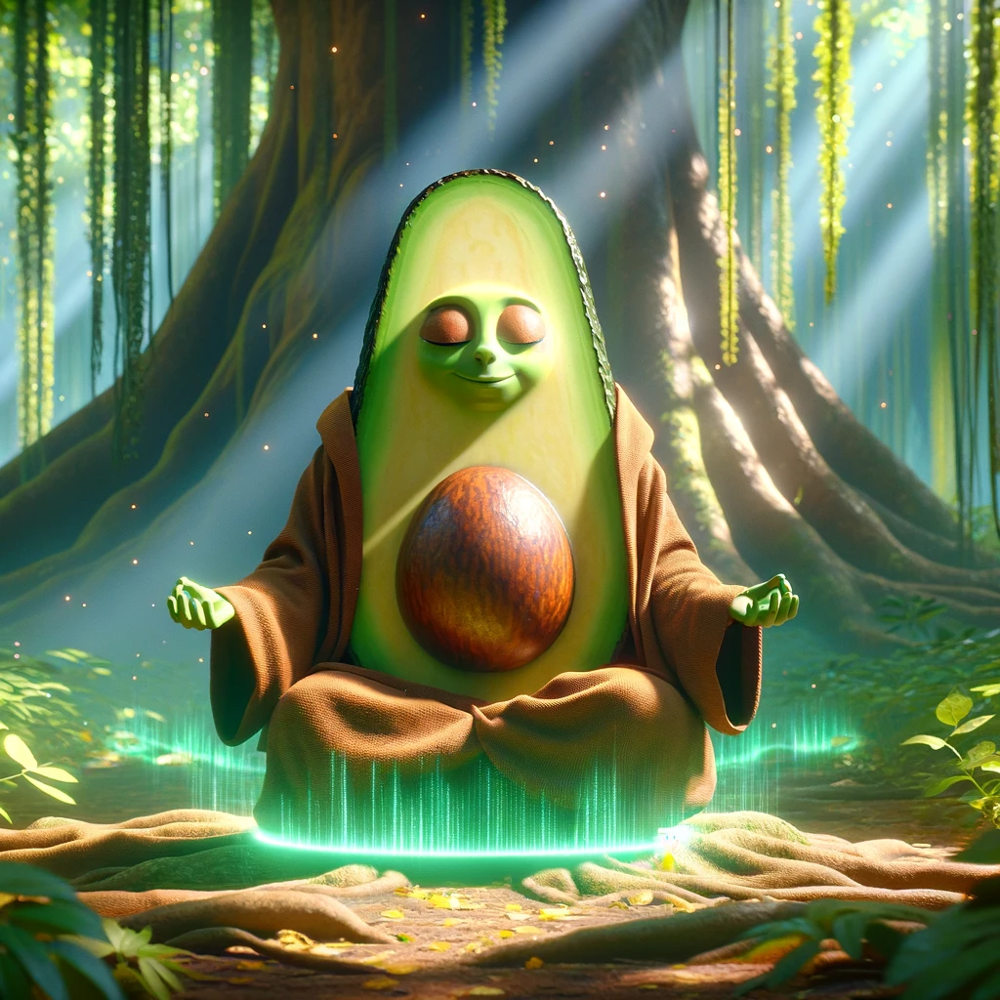

A story about avocado jedi generated by [DALLE3](https://openai.com/dall-e-3), the prompted are provided below the images, please enjoy 😊!.

## Chapter 1: The Seed of Destiny

In the vast galaxy of Frutopia, a unique avocado was born on the planet Verdantia. Unlike its peers, this avocado had a pit that occasionally emitted a soft glow. The Elders of Verdantia recognized this as a sign of the ancient Fruit Force and named the avocado "Avo-Wan" !

> 2D animation still of the galaxy of Frutopia with planet Verdantia shining brightly. In the foreground, a young avocado named Avo-Wan stands with a glowing pit, surrounded by the Elders of Verdantia who gaze at him with admiration.

## Chapter 2: Training Days

Avo-Wan was taken under the wing of Master Grapefruit, a wise and ancient fruit known for his knowledge of the Fruit Force. Under the shade of the giant tree, Master Grapefruit taught Avo-Wan the ways of the Fruit Force - levitation, telekinesis, and the art of lightsaber combat.

>2D animation still of a young avocado named Avo-Wan wearing a small brown robe and a training lightsaber, being instructed by a Jedi Master who is a wise, elder grapefruit with a wooden staff. They are in a peaceful glade with soft beams of sunlight piercing through the foliage, and Avo-Wan is surrounded by floating fruits, demonstrating his telekinetic mastery of the Fruit Force.

> 2D animation scene where the avocado Jedi is training under a large tree. It uses the Force to levitate various fruits around, such as apples, bananas, and grapes, demonstrating its growing skills.

> 2D animation of the avocado Jedi meditating in a serene garden. The surroundings are calm, with a gentle waterfall in the background. As the avocado meditates, its pit glows brighter, symbolizing its connection with the Force.

## Chapter 3: The Tomato Menace

The galaxy of Frutopia is shaken by the rise of Tomatous, a powerful Tomato Sith causing chaos in Vegtopia and threatening to extend his control to Frutopia. The Fruit Council is alarmed by his actions, which involve harnessing Vegtopian Crystals to increase his power. 

Avo-Wan, trained in the ways of the Fruit Force, resolves to confront this menacing figure. Preparing through meditation and guidance from the Fruit Force, Avo-Wan sets out to Vegtopia, determined to end Tomatous's tyranny and restore peace.

## Chapter 4: Duel of Fates

In the heart of Vegtopia, Avo-Wan and Tomatous clashed. Their battle was fierce, lightsabers illuminating the dark skies. But Avo-Wan's training and connection to the Fruit Force gave him an edge. Using a special move taught by Master Grape Yoda, Avo-Wan disarmed Tomatous, bringing peace to the galaxies.

> Note: Avo-Wan face should be avocado, not tomatoes. 