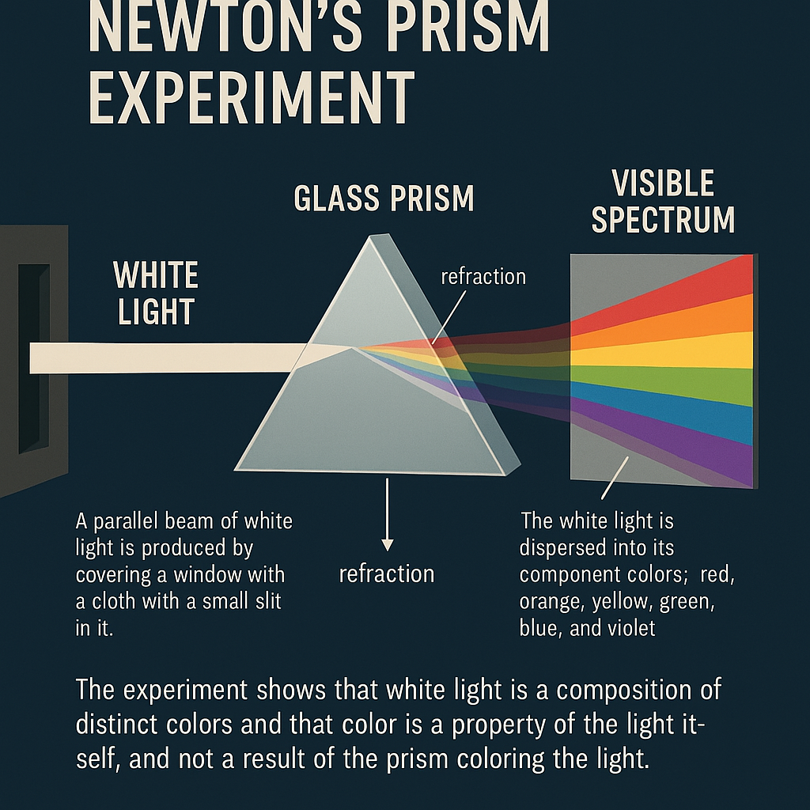
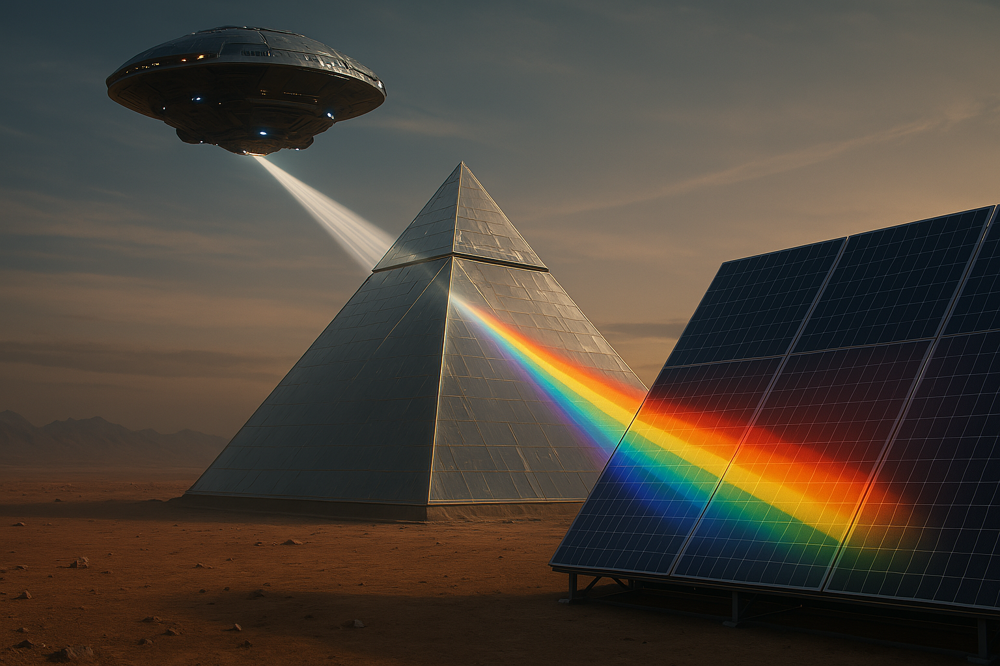

Testing ChatGPT Image Generation Features

## Prism Experiment

**Prompt:** An infographic explaining newton's prism experiment in great detail

## In the year 2150

**Prompt:** Now, generate a photorealistic of a scene in the year 2150, where this experiment is conducted to a hypothetical Egyptian pyramids made of prism. The white light is shining from a hovercraft spaceship. The spectrum of light is cast on a large sheet of solar cells. 

